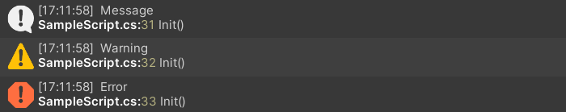
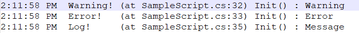
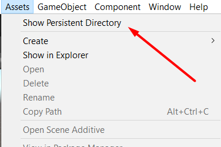

## Simple game logger with recording into file.
### Installation Package Manager

Open Package Manager =>
Tap on plus button => 
Add package from git URL =>
Put inside https://github.com/dragoff/game-logger.git

## Using 
Log as usual,
```c#
GDebug.Log("Message");
GDebug.LogWarning("Warning");
GDebug.LogError("Error");
```


Log with title,  
```c#
GDebug.Log("Message", ("GameLogger", Color.red));
```


Log to file only, 
```c#
GDebug.LogToFile("Message");
``` 


Start logging into empty file and rename the old file to GameLog.old,  
```c#
GDebug.ResetLogFile();
```        

## Saves the logs to a persistent path.

***Note:***  Contains menu item button to open persistent path.


